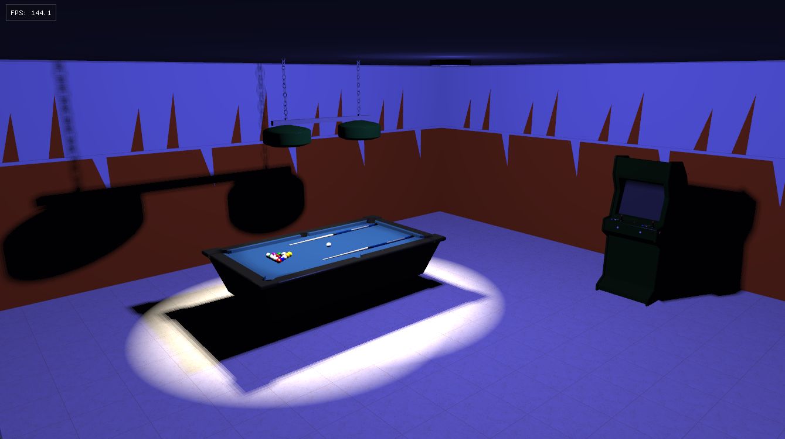
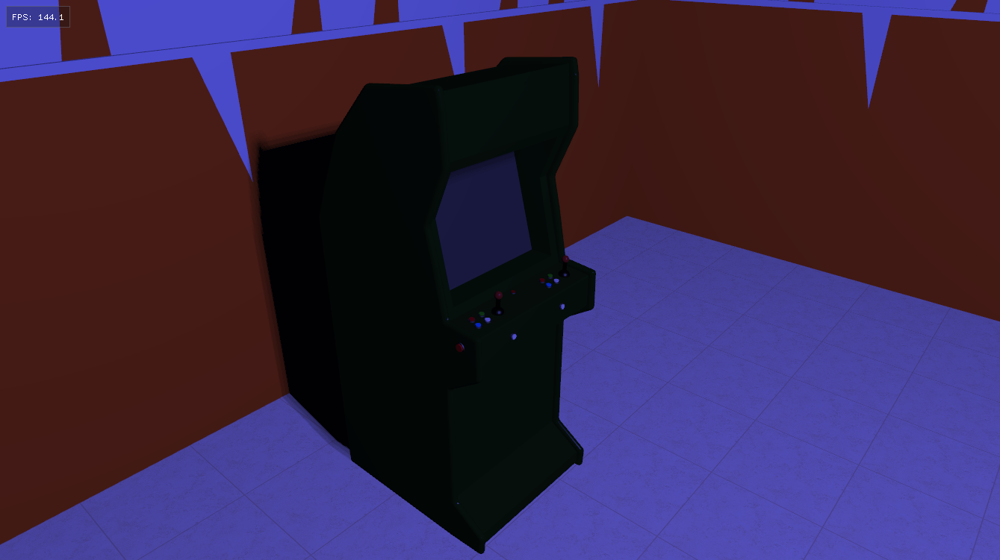
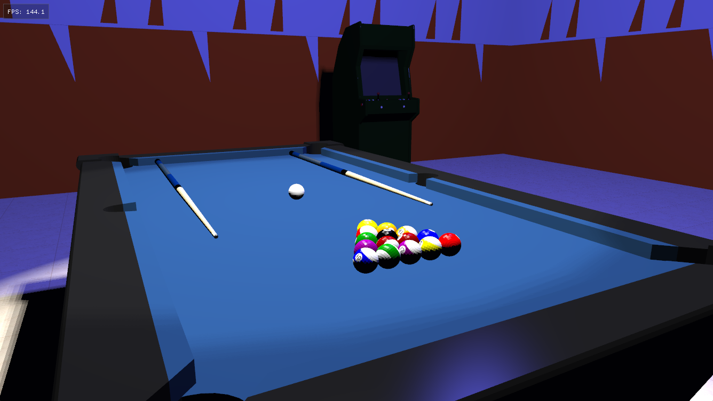
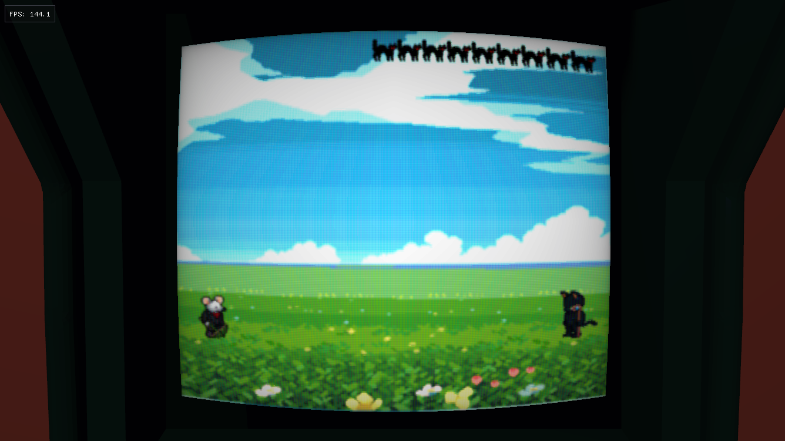
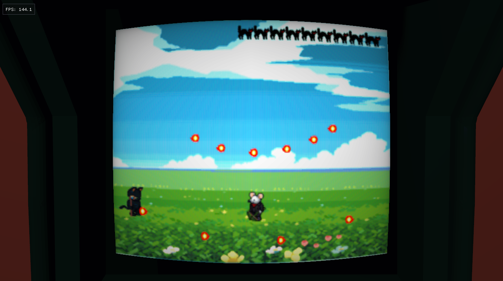

# RoyalGreen

RoyalGreen is a work-in-progress 3D simulation of a retro arcade room. Its name and some of its details are a tribute to an old arcade bar.
The application is written in **C++17**, and the graphics API used is **OpenGL** `3.3 Core Profile`.

## How to run the application
The fastest (and simplest) way to run the application:
- Create the directory `C:\dev\RoyalGreen\` on your system.
- Download the `res` folder from the repository and put it in `C:\dev\RoyalGreen\`.
- Download `royalgreen.exe` from the latest release.
- Run the executable.

Alternatively, you can build the application manually with **CMake**.

## How to build the application

> **Important:**  
> This project depends on the library **glm** (version `0.9.9.8`), which requires  
> `cmake_minimum_required(VERSION 3.2)`.  
> Starting from **CMake 4.0**, compatibility with versions `< 3.5` has been dropped.
> **Visual Studio 2022** version `17.14.x` includes a **CMake** version that still supports `< 3.5`.  
> For example, **Visual Studio 2022** `17.14.0` ships with **CMake 3.31.6-msvc6**.

### Build with **Visual Studio**
- Download the source code and extract the `RoyalGreen-main` directory wherever you want.
- Open the directory with **Visual Studio**.
- **CMake** compilation should start by itself. If not, press `F5`.
- After the **CMake** build is complete, you can compile and run the code (with the GUI button or with `F5`).

### Build with **CMake** (only if you have a version of **CMake** compatible with version `<3.5`)
- Download the source code and extract the `RoyalGreen-main` directory wherever you want.
- Open the directory in a terminal. Verify your **CMake** installation with the command: `cmake --version`.
- Run: `cmake -S . -B build`.
- Then: `cmake --build build`.
- After the process completes, you will find the executable inside: `RoyalGreen-main\build\Debug\royalgreen.exe`.
- Run the executable.

## Dependencies
**CMake** uses `FetchContent` to retrieve external dependencies from public repositories:
- **GLFW** `3.4` for window creation, input handling, and OpenGL context management  .
- **Dear ImGui** `v1.91.9` for debugging interfaces and menus.
- **Assimp** `v6.0.2` for importing and processing 3D model in `OBJ` format. 
- **stb** `master` for image loading and texture handling.
- **glm** `0.9.9.8` for mathematics and linear algebra operations.

---
## Preview.

